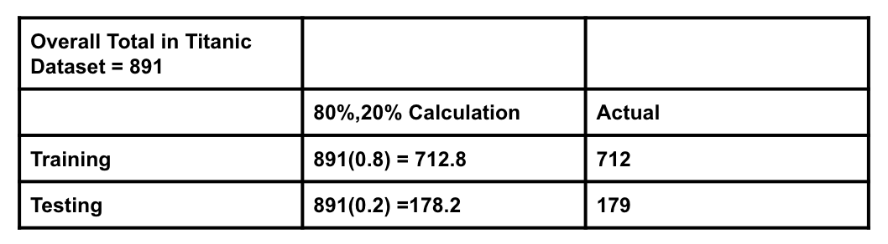

```{r setup, include=FALSE}
knitr::opts_chunk$set(echo = TRUE, message = FALSE,
                      warning = FALSE)
```

## Classification

For this assignment, we will be working with part of a [Kaggle data set](https://www.kaggle.com/c/titanic/overview) that was the subject of a machine learning competition and is often used for practicing ML models. The goal is classification; specifically, to predict which passengers would survive the [Titanic shipwreck](https://en.wikipedia.org/wiki/Titanic).

Load the data from `data/titanic.csv` into *R* and familiarize yourself with the variables it contains using the codebook (`data/titanic_codebook.txt`).

Notice that `survived` and `pclass` should be changed to factors. When changing `survived` to a factor, you may want to reorder the factor so that *"Yes"* is the first level.

Make sure you load the `tidyverse` and `tidymodels`!

*Remember that you'll need to set a seed at the beginning of the document to reproduce your results.*

(Note: We will be setting a seed in Question 1)
```{r}
# Load in dataset using the read.csv() function
titanic <- read.csv(file = 'titanic.csv')

# Load in the needed packages
library(ggplot2)
library(tidyverse)
library(tidymodels)
library(corrplot)
library(poissonreg)
library(discrim)
library(klaR) # for naive bayes
library(MASS)
library(corrr) # for correlation matrix 
library(pROC) # for ROC 
tidymodels_prefer()

## Notice that `survived` and `pclass` should be changed to factors. When changing `survived` to a factor, you may want to reorder the factor so that *"Yes"* is the first level.

# change `survived` and `pclass` into factors 
titanic$survived <- as.factor(titanic$survived)
# this is to reorder the factor so that "Yes" is the first level
titanic$survived <- relevel(titanic$survived,"Yes")
# using contrasts function to view the levels 
contrasts(titanic$survived)
titanic$pclass <- as.factor(titanic$pclass)
# using contrasts function to view the levels 
contrasts(titanic$pclass)

# Note we will be factoring sex as it was interfering with the accuracy in #9  
titanic$sex <- as.factor(titanic$sex)
contrasts(titanic$sex)

# Look at the first couple of observations to get a feel for the dataset
head(titanic)
```
### Question 1

Split the data, stratifying on the outcome variable, `survived.` You should choose the proportions to split the data into. Verify that the training and testing data sets have the appropriate number of observations. Take a look at the training data and note any potential issues, such as missing data.

Why is it a good idea to use stratified sampling for this data?
```{r}
# Need to set seed as the splitting process is random
# choose favorite number 27 
set.seed(27)
# Split the data
titanic_split <- initial_split(titanic, prop = 0.80,
                                strata = survived)
# training data 
titanic_train <- training(titanic_split)
# test data 
titanic_test <- testing(titanic_split)

# Look at the number of obs in training and testing combined 
# note that 80% of total is 712.8 and 20% of total is 178.2
# total amount of obs 
total <- count(titanic) 
total
# amount of obs for training 
training_n <- count(titanic_train) 
training_n 
# amount of obs for testing  
testing_n <- count(titanic_test)
testing_n
```
Answer(Question 1): Note for splitting the data we will be using a 80/20 percentage split (80% for training, 20% for test). It is a good idea to use stratified sampling for this dataset because we want to obtain a sample population that best represents the entire population that is being studied. When we set the seed (to obtain a random sample), because there is a imbalance in "Yes" and "No" in survived, we could get a sample that does not represent the population (maybe all yes or all no, or not enough of both to be represented); using strata/bins fixes this. 

Then, to verify that the training and testing data sets have the appropriate number of observations we can look at the following chart: 

```{r pressure, echo=FALSE, out.width = '100%'}

```
Here we can see that the values are about the same, verifying that the training and testing data sets have the appropriate number of observations. 

Moreover, we can take a look at the training data for potential issues: 
```{r}
head(titanic_train)
# Check to see if there are any missing values, yes 
# use head to not output everything 
head(is.na(titanic_train)) 
# Look where most of the missing data is 
colSums(is.na(titanic_train))
```
We note that there is missing values in the training data; in particular there are 146 missing values in "age" and 543 missing values in "cabin". In addition, we can also note that "name" and "ticket" might offer some complexity as there are a lot of different values. 

### Question 2

Using the **training** data set, explore/describe the distribution of the outcome variable `survived`.
```{r}
# To describe the distribution we will be looking at a bar chart  
titanic_train %>% 
  ggplot(aes(x = survived)) +
  geom_bar()
count_sur <- nrow(subset(titanic_train, survived=="Yes"))
count_sur
count_died <- nrow(subset(titanic_train, survived=="No"))
count_died
```
Answer(Question 2): This bar chart depicts the number of passengers that did or did not survive the titanic in our training dataset. We can note that there are more people who died (439) than survived (273); this is pretty uneven. 

### Question 3

Using the **training** data set, create a correlation matrix of all continuous variables. Create a visualization of the matrix, and describe any patterns you see. Are any predictors correlated with each other? Which ones, and in which direction?
```{r}
# Create a correlation matrix - visual 
cor_titanic_train <- titanic_train %>%
  # remove all discrete variables 
  select(-c(survived, pclass, name, sex, ticket, cabin, embarked)) %>%
  correlate()
  # create a visualization of the matrix 
rplot(cor_titanic_train)
```
Create a heatmap-style correlation plot for better interpretation (as this includes numbers): 

```{r}
# Create a heatmap-style correlation plot that can allow for better reading 
cor_titanic_train %>%
  stretch() %>%
  ggplot(aes(x, y, fill = r)) +
  geom_tile() +
  geom_text(aes(label = as.character(fashion(r))))
```

* There is a positive correlation (0.42) between variable sib_sp (# of siblings / spouses aboard the Titanic) and parch (# of parents / children aboard the Titanic). 
* There is a positive correlation (0.21) between variable parch (# of parents / children aboard the Titanic) and fare. 

* There a is negative correlation (-0.31) between age and sib_sp (# of siblings / spouses aboard the Titanic)
* There a is negative correlation (-0.21) between parch (# of parents / children aboard the Titanic) and age. 

### Question 4

Using the **training** data, create a recipe predicting the outcome variable `survived`. Include the following predictors: ticket class, sex, age, number of siblings or spouses aboard, number of parents or children aboard, and passenger fare.

Recall that there were missing values for `age`. To deal with this, add an imputation step using `step_impute_linear()`. Next, use `step_dummy()` to **dummy** encode categorical predictors. Finally, include interactions between:

-   Sex and passenger fare, and
-   Age and passenger fare.

You'll need to investigate the `tidymodels` documentation to find the appropriate step functions to use.
```{r}
# Create recipe using the training data, predicting the outcome
# variable `survived`
# make sure we have the predictors we need 
titanic_recipe <- recipe(survived ~ pclass + sex + age + sib_sp 
                         + parch + fare, data = titanic_train)%>% 
  # add imputation step using `step_impute_linear()` - age 
  step_impute_linear(age)%>%
  # **dummy** encode categorical predictors 
  step_dummy(all_nominal_predictors())%>%
  # interaction between Sex and passenger fare
  # note since we factored sex, we will use sex_male 
  step_interact(terms = ~ sex_male:fare)%>%
  # interaction between Age and passenger fare
  step_interact(terms = ~ age:fare)
titanic_recipe
```


### Question 5

Specify a **logistic regression** model for classification using the `"glm"` engine. Then create a workflow. Add your model and the appropriate recipe. Finally, use `fit()` to apply your workflow to the **training** data.

***Hint: Make sure to store the results of `fit()`. You'll need them later on.***
```{r}
#Specify a logistic regression model for classification using the `"glm"` engine.
# use training data 
log_reg_titanic <- logistic_reg() %>% 
  set_engine("glm") %>% 
  set_mode("classification")

# Create a workflow
log_wkflow_titanic <- workflow() %>% 
  # add model 
  add_model(log_reg_titanic) %>% 
  # add recipe 
  add_recipe(titanic_recipe)

# use fit() to apply workflow to training data 
log_fit_titanic <- fit(log_wkflow_titanic, titanic_train)
```

### Question 6

**Repeat Question 5**, but this time specify a linear discriminant analysis model for classification using the `"MASS"` engine.
```{r}
# specify a linear discriminant analysis model for classification 
# using the `"MASS"` engine
lda_mod_titanic <- discrim_linear() %>% 
  set_mode("classification") %>% 
  set_engine("MASS")

# Create a workflow, add model, add recipe 
lda_wkflow_titanic <- workflow() %>% 
  add_model(lda_mod_titanic) %>% 
  add_recipe(titanic_recipe)

# use fit() to apply workflow to training data 
lda_fit_titanic <- fit(lda_wkflow_titanic, titanic_train)
```

### Question 7

**Repeat Question 5**, but this time specify a quadratic discriminant analysis model for classification using the `"MASS"` engine.
```{r}
# specify a quadratic discriminant analysis model for classification 
# using the `"MASS"` engine
qda_mod_titanic <- discrim_quad() %>% 
  set_mode("classification") %>% 
  set_engine("MASS")

# Create a workflow, add model, add recipe 
qda_wkflow_titanic <- workflow() %>% 
  add_model(qda_mod_titanic) %>% 
  add_recipe(titanic_recipe)

# use fit() to apply workflow to training data 
qda_fit_titanic <- fit(qda_wkflow_titanic, titanic_train)
```


### Question 8

**Repeat Question 5**, but this time specify a naive Bayes model for classification using the `"klaR"` engine. Set the `usekernel` argument to `FALSE`.
```{r}
# specify a naive Bayes model for classification 
nb_mod_titanic <- naive_Bayes() %>% 
  set_mode("classification") %>% 
  # use the `"klaR"` engine
  set_engine("klaR") %>% 
  # Set the `usekernel` argument to `FALSE`
  set_args(usekernel = FALSE) 

# Create a workflow, add model, add recipe
nb_wkflow_titanic <- workflow() %>% 
  add_model(nb_mod_titanic) %>% 
  add_recipe(titanic_recipe)

# use fit() to apply workflow to training data 
nb_fit_titanic <- fit(nb_wkflow_titanic, titanic_train)
```


### Question 9

Now you've fit four different models to your training data.

Use `predict()` and `bind_cols()` to generate predictions using each of these 4 models and your **training** data. Then use the *accuracy* metric to assess the performance of each of the four models.


```{r}
# Use `predict()` and `bind_cols()` to generate predictions using each of the 
# 4 models and training data

# Note we didn't use type = "prob", this is redundent, will use augment 
# to attach predicted values to the data then generate the accuracy

log_prediction <- predict(log_fit_titanic, new_data = titanic_train)
lda_prediction <- predict(lda_fit_titanic, new_data = titanic_train)
qda_prediction <- predict(qda_fit_titanic, new_data = titanic_train)
nb_prediction <- predict(nb_fit_titanic, new_data = titanic_train)

predictions <- bind_cols(log_prediction, lda_prediction, 
                         qda_prediction, nb_prediction, titanic_train$survived)

# add names to the columns 
names(predictions) <- c("Log Reg Prediction", "LDA Prediction", "QDA Prediction", "NB Prediction", "survived")
predictions 

```
```{r}
# Use use the accuracy metric to assess the performance of each of the four models
# Note we used the augment() to attach the predicted values to the data, 
# then generate the accuracy metric 
log_accuracy <- augment(log_fit_titanic, new_data = titanic_train) %>%
  accuracy(truth = survived, estimate = .pred_class)

lda_accuracy <- augment(lda_fit_titanic, new_data = titanic_train) %>%
  accuracy(truth = survived, estimate = .pred_class)

qda_accuracy <- augment(qda_fit_titanic, new_data = titanic_train) %>%
  accuracy(truth = survived, estimate = .pred_class)

nb_accuracy <- augment(nb_fit_titanic, new_data = titanic_train) %>%
  accuracy(truth = survived, estimate = .pred_class)

accuracies <- c(log_accuracy$.estimate, lda_accuracy$.estimate, 
                qda_accuracy$.estimate, nb_accuracy$.estimate)

models <- c("Log Reg Acc", "LDA Acc", "QDA Acc", "NB ACC")

model_accuracies <- tibble(models=models, accuracies=accuracies)
model_accuracies
```

Which model achieved the highest accuracy on the training data?

Answer(Question 9): The logistic regression model for classification using the `"glm"` engine yields the highest accuracy on the training data (Log Reg Acc = 0.8160112). 

### Question 10

Fit the model with the highest training accuracy to the **testing** data. Report the accuracy of the model on the **testing** data.

```{r}
# Fit the model to a logistic regression model, use testing data
augment(log_fit_titanic, new_data = titanic_test) %>%
  accuracy(truth = survived, estimate = .pred_class)
```
Answer(Question 10): Since the logistic regression model preformed the best (yielded the highest training accuracy on the training data), we'll go ahead and fit it to the testing data. The accuracy of the model on the testing data is 0.8156425. 

Again using the **testing** data, create a confusion matrix and visualize it. Plot an ROC curve and calculate the area under it (AUC).
```{r}
# First we use augment to attach the predicted values to the data, 
# then generate a confusion matrix
augment(log_fit_titanic, new_data = titanic_test) %>%
  conf_mat(truth = survived, estimate = .pred_class) %>%
  # visualize 
  autoplot(type = "heatmap")
```
Answer(Question 10): Plot of the ROC Curve: 

```{r}
# Plot an ROC curve 
augment(log_fit_titanic, new_data = titanic_test) %>%
  roc_curve(survived, .pred_Yes)%>%
  autoplot()
```
```{r}
# calculate the area under it (AUC)
store <- augment(log_fit_titanic, new_data = titanic_test)
log_roc <- roc(titanic_test$survived, store$.pred_Yes)
auc(log_roc)
```
Answer(Question 10): After plotting the ROC curve, we find that the area under the curve (AUC) is 0.8474.  

How did the model perform? Compare its training and testing accuracies. If the values differ, why do you think this is so?

Answer(Question 10): The training accuracy was 0.8160112 while the testing accuracy was 0.8156425. Note the values do differ, the training accuracy is slightly higher than the testing accuracy. I think this is the case because we selected the model based on it's accuracy on the training dataset rather than its accuracy on the (unseen) test dataset. 